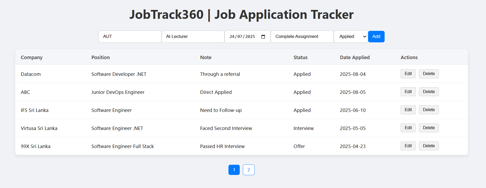

# 🚀 Welcome to JobTrack360 - Your Personal Job Application Tracker
🔧Backend 
🖥️Frontend

# 🔧 JobTrack360 | Job Application Tracker - Backend API


Backend API for the **JobTrack360** app, built with **ASP.NET Core Web API** and **Entity Framework Core (In-Memory)**. 
It allows users to track job applications, including the company name, position, User Notes, application status, and date applied.

---

## ⚙️ Backend Technologies Used

- ASP.NET 9
- Entity Framework Core (In-Memory)
- xUnit for Unit Testing
- Swagger (OpenAPI)
- Repository Pattern
- Clean Architecture
- Dependency Injection (DI)
- RESTful API

---


### 1. 📦 Prerequisites

- [.NET SDK](https://dotnet.microsoft.com/en-us/download)
- IDE like Visual Studio, VS Code
- A tool like Postman or Swagger to test APIs.

### 2. 📁 Clone the Repository

```bash
git clone https://github.com/harshanaerandaperera/JobTrack360.git
cd JobTrack360/JobTrack360.API
```

### 3. Project Structure : Clean Architecture

```
JobTrack360/
│
├── JobTrack360.API/                ← Presentation Layer (Web API)
│   ├── Controllers/
│   │   └── JobApplicationsController.cs
│   ├── appsettings.json
│   ├── Program.cs
│   └── JobTrack360.API.csproj
│
├── JobTrack360.Application/        ← Application Layer (interfaces)
│   ├── Interfaces/
│   │   └── IJobApplicationRepository.cs
│   └── JobTrack360.Application.csproj
│
├── JobTrack360.Domain/             ← Domain Layer (Entities, Enums)
│   ├── Entities/
│   │   └── JobApplication.cs
│   ├── Enums/
│	│   └── JobStatus.cs
│   └── JobTrack360.Domain.csproj
│
├── JobTrack360.Infrastructure/     ← Infrastructure Layer (EF Core, Repositories)
│   ├── Data/
│   │   └── ApplicationDbContext.cs
│   ├── Repositories/
│   │   └── JobApplicationRepository.cs
│   └── JobTrack360.Infrastructure.csproj
│
├── JobTrack360.Tests.Unit/	        ← xUnit Tests
│	├── Domain/
│	│   └── JobApplicationTests.cs
│	├── Repositories/
│	│   └── JobApplicationRepositoryTests.cs
│	└──	JobTrack360.Tests.Unit.csproj
│
├── JobTrack360.sln
```

### 4. 🛠️ Run the Backend
```bash
dotnet run
```

### 5. 🌐 API Endpoints

```
| Method | Endpoint                    | Description                |
| ------ | --------------------------- | -------------------------- |
| GET    | `/api/JobApplications`      | Get all job applications   |
| GET    | `/api/JobApplications/{id}` | Get a specific application |
| POST   | `/api/JobApplications`      | Add a new application      |
| PUT    | `/api/JobApplications/{id}` | Update an application      |
| DELETE | `/api/JobApplications/{id}` | Delete an application      |
```


# 🖥️ JobTrack360 | Job Application Tracker - Frontend



A React-based frontend for managing your job applications enabling users to add, view, edit, and delete job entries.

## ⚙️ Frontend Technologies Used

- React with JavaScript
- Create React App (CRA)
- Axios
- React Hooks
- HTML & CSS

---

### 1. 📦 Prerequisites

- Node.js (v18+)
- npm
- A code editor like VS Code with the React/JS plugins

### 2. Project Structure

```
jobtrack360.ui/
│
├── public/
│	└── index.html
├── src/
│   ├── components/
│   │   ├── ApplicationForm.jsx
│   │   ├── ApplicationsTable.jsx
│   │
│   ├── services/
│   │   └── api.js
│   │
│   ├── App.jsx
│   ├── index.js
│   └── index.css
│
├── package.json
└── README.md

```

### 3. 🛠️ Run the Frontend
```bash
cd jobtrack360.ui
npm install
npm start
```
By default, the app will be served at http://localhost:3000

### 4. 🔗 Connecting to the Backend
Set Backend running url to jobtrack360.ui/src/services/api.js baseURL accordingly.
You are Done ✅ !!

### 🎨 JobTrack360 | Features

- ✅ List all job applications
- ➕ Add new applications
- ✏️ Edit application status/notes
- 🗑️ Delete applications
- 🔽 Status dropdown (Applied, Interview, Offer, Rejected)

### 🧪 Assumptions

- ✅ A Notes field was added to allow users to add remarks about each application.
- ✅ If the Date Applied is not sent from the client, the backend will automatically set it to the current date (DateTime.UtcNow.Date).
- ✅ Users can add job applications for any calendar date.
- ❌ After adding a job application, users cannot edit the Company Name, Position, or Date Applied. Only Status and Notes are editable.
- 🗑️ Users can delete job applications permanently.
- 📄 Pagination is implemented with maximum 5 applications per page.


## 👨‍💻 **Creator**

**Harshana Perera**  
**Software Engineer | Developer | Tech Enthusiast**  
[LinkedIn](https://www.linkedin.com/in/harshanaerandaperera/)

This project was developed using Monorepo architecture, with both the backend (ASP.NET Core Web API) and frontend (React) in a single repository for streamlined development and deployment.