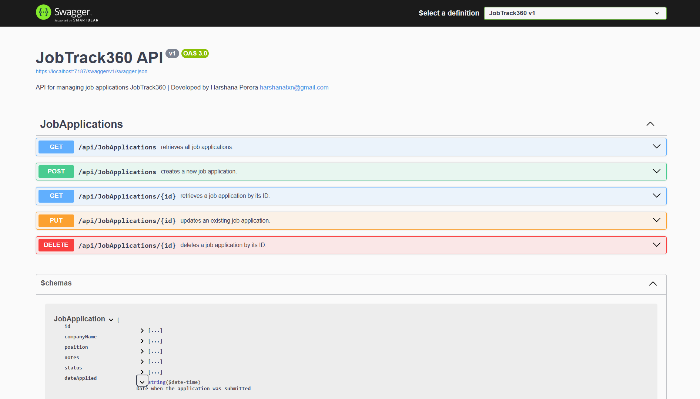



# 📌 Job Application Tracker - Backend API

This is the backend API for the **JobTrack360** app, built with **ASP.NET Core Web API** and **Entity Framework Core (In-Memory)**. 
It allows users to track job applications, including the company name, position, User Notes, application status, and date applied.

---

## ⚙️ Technologies Used

- ASP.NET 9
- Entity Framework Core (In-Memory)
- Swagger (OpenAPI)
- Repository Pattern
- Clean Architecture
- Dependency Injection (DI)
- RESTful API

---


### 1. 📦 Prerequisites

- [.NET SDK](https://dotnet.microsoft.com/en-us/download)
- IDE like Visual Studio, VS Code

### 2. 📁 Clone the Repository

```bash
git clone https://github.com/harshanaerandaperera/JobTrack360BE.git
cd JobTrack360BE
```

### 3. Project Structure : Clean Architecture

```
JobTrack360/
│
├── JobTrack360.API/                ← Presentation Layer (Web API)
│   ├── Controllers/
│   │   └── JobApplicationsController.cs
│   ├── appsettings.json
│   ├── Program.cs
│   └── JobTrack360.API.csproj
│
├── JobTrack360.Application/        ← Application Layer (interfaces)
│   ├── Interfaces/
│   │   └── IJobApplicationRepository.cs
│   └── JobTrack360.Application.csproj
│
├── JobTrack360.Domain/            ← Domain Layer (Entities, Enums)
│   ├── Entities/
│   │   └── JobApplication.cs
│   └── JobTrack360.Domain.csproj
│
├── JobTrack360.Infrastructure/    ← Infrastructure Layer (EF Core, Repositories)
│   ├── Data/
│   │   └── ApplicationDbContext.cs
│   ├── Repositories/
│   │   └── JobApplicationRepository.cs
│   └── JobTrack360.Infrastructure.csproj
│
├── JobTrack360.sln
```

### 4. 🛠️ Run the Application
```bash
	dotnet run
```